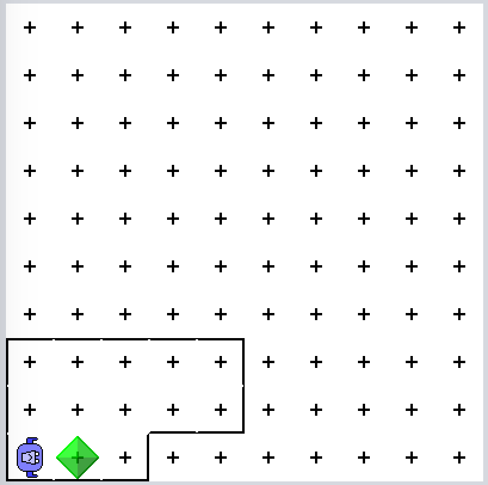
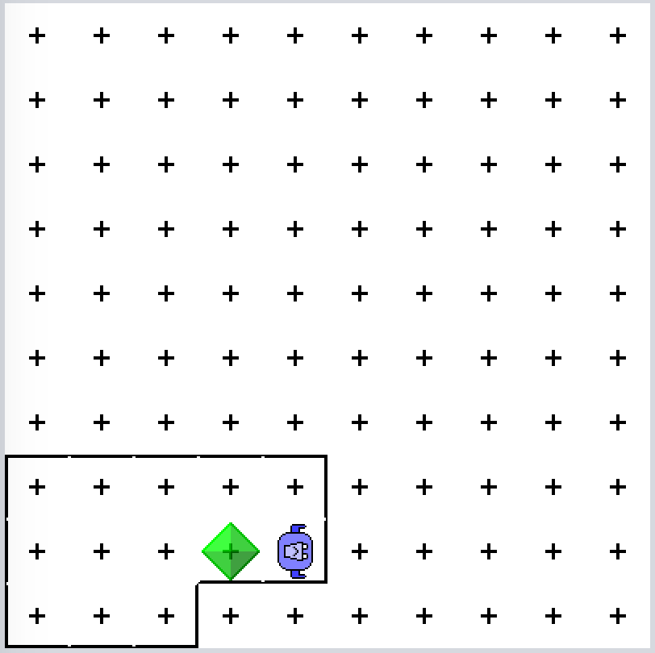

# 0.0.1 karelsFirstProgram

## Task
Click the GOAL button (top left)
and watch Karel go. Drag slider
to adjust animation speed.
Can you program Karel to perform
the same steps? Test with START!

|Starting position|Goal|
|:---:|:---:|
|||


## Pre defined methods
```
dropBeeper();
moveForward();
pickBeeper();
turnLeft();
turnRight();
```
Source: https://github.com/fredoverflow/karel#primitive-commands

## Solution

```
void karelsFirstProgram() 
{
    moveForward();
    pickBeeper();
    moveForward();
    turnLeft();
    moveForward();
    turnRight();
    moveForward();
    dropBeeper();
    moveForward();
}
```
## Video

<iframe width="560" height="315" src="https://www.youtube.com/embed/szEaYShCctI" frameborder="0" allow="accelerometer; clipboard-write; encrypted-media; gyroscope; picture-in-picture" allowfullscreen></iframe>